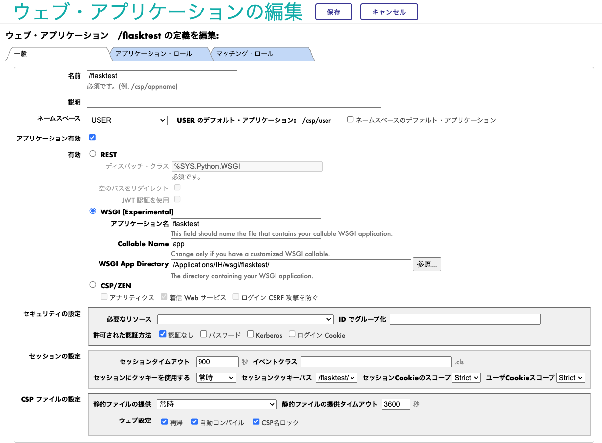
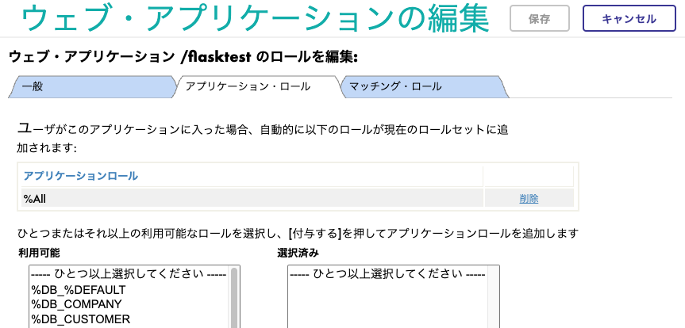
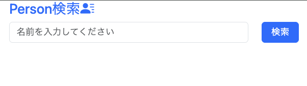
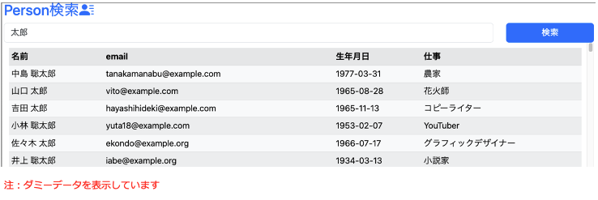

# IrisWsgiDemo

### 背景・概要
InterSystems IRIS 2024.1でWSGI準拠のWebアプリケーションを管理できるようになりました(試験リリース)。

このプロジェクトはIRIS上に作成した人物テーブルを名前で検索して表示する、シンプルなWebアプリケーションです。

WSGIに準拠したWebフレームワーク・Flaskを利用しています。
InterSystems 2024.1以降で利用することを想定しています。

### 事前準備

+ [create-table.sql](setup/create-table.sql "create-table.sql")のSQLを任意のネームスペースで実行します。

  - create-table.sql はtest.personテーブルを作成します。

+ 必要なライブラリのインストール

例）
~~~ 
(WebフレームワークFlask)
python3 -m pip install --target <IRISインストールディレクトリ>/mgr/python flask

(ダミーデータ生成用)
python3 -m pip install  --target <IRISインストールディレクトリ>/mgr/python faker
python3 -m pip install  --target <IRISインストールディレクトリ>/mgr/python sqlalchemy-iris
~~~

+ ダミーデータの生成
  + [insert-dummy-data.sql](insert-dummy-data.sql)をEmbedded Pythonで実行します
    + 例)  `<IRISインストールディレクトリ>/bin/irispython insert-dummy-data.py`

  + insert-dummy-data.pyはtest.personテーブルへダミーデータを登録します。
  + ※事前にinsert-dummy-data.pyのIRIS接続情報を書き換えてください。

### ソースの配置

[src](src)配下をIRISがアクセスできる場所(インストールディレクトリ配下等)へ配置します。

### Webアプリケーションの作成

IRIS管理ポータルで下記を実行します。

[システム管理]→[セキュリティ]→[アプリケーション]→[ウェブアプリケーション]→[新しいウェブ・アプリケーションを作成]

一般タブ：

下記を入力し、保存します。
<dl>

<dt>名前</dt><dd>/flasktest (アクセスする際のURLとなる)</dd> 

<dt>ラジオボタン</dt><dd>WSGI [Experimental]を選択</dd>

<dt>アプリケーション名</dt> <dd>flasktest (Pythonのファイル名)</dd>
<dt>Callable Name</dt> <dd>app (Flaskをインスタンス化した際の変数名)</dd>
<dt>WSGI App Directory</dt> <dd>ソースコードを配置したフォルダを指定</dd>
</dl>

アプリケーション・ロールタブ:

データベースアクセスに必要なロールを付与します。

※下図では全ての権限を持つものを付与していますが、本運用では必要な権限を持つもののみ付与してください。

### ブラウザでアクセス
http://(Webサーバ)/flasktest にアクセスすると、下図のような画面が表示されます。

IRISに登録されたPersonテーブルのデータを名前で検索することができます。

### 注記

* ソースコードはデモンストレーション用途を前提としています。
  * セキュリティやエラー処理が十分に考慮されていない可能性がありますので、ご留意ください。
* こちらのソースは下記で紹介されているPythonコードをベースに作成しています。

https://jp.community.intersystems.com/post/%E3%83%90%E3%83%BC%E3%82%B8%E3%83%A7%E3%83%B320241%EF%BC%9A%E6%96%B0%E6%A9%9F%E8%83%BD%E7%B4%B9%E4%BB%8B%E3%82%A6%E3%82%A7%E3%83%93%E3%83%8A%E3%83%BC%E9%96%8B%E5%82%AC%E6%B1%BA%E5%AE%9A%EF%BC%81%EF%BC%884%E6%9C%88%EF%BD%9E6%E6%9C%88%EF%BC%89

### リソース

[InterSystems IRIS - WSGIアプリケーションの作成](https://docs.intersystems.com/iris20241/csp/docbookj/Doc.View.cls?KEY=AWSGI)

[InterSystems 開発者コミュニティ](https://jp.community.intersystems.com/)

[YouTubeチャンネル - InterSystems 開発者コミュニティ](https://www.youtube.com/@intersystems9975)
